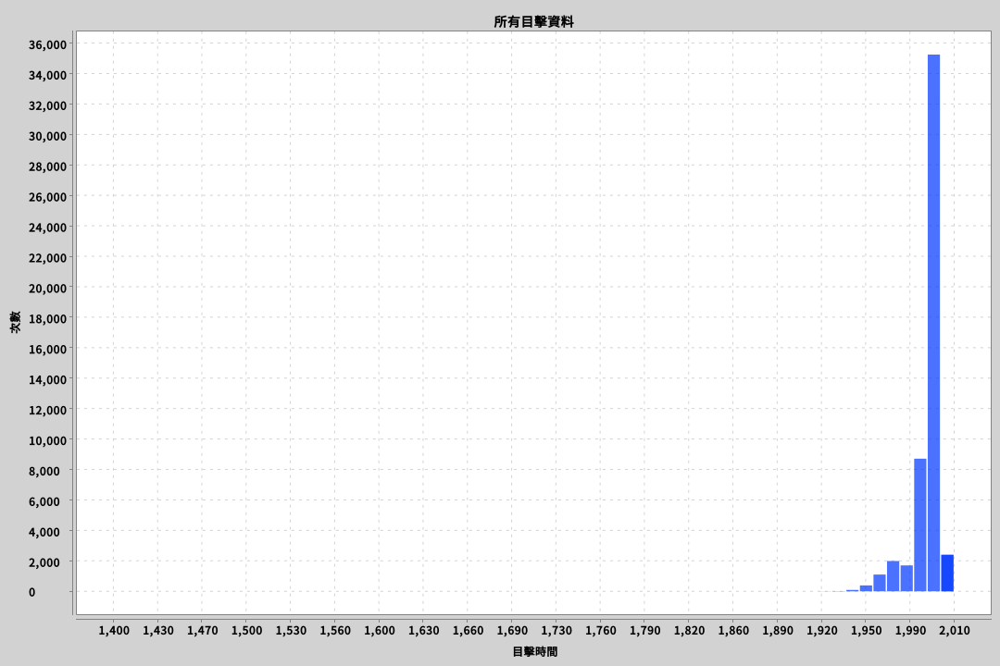
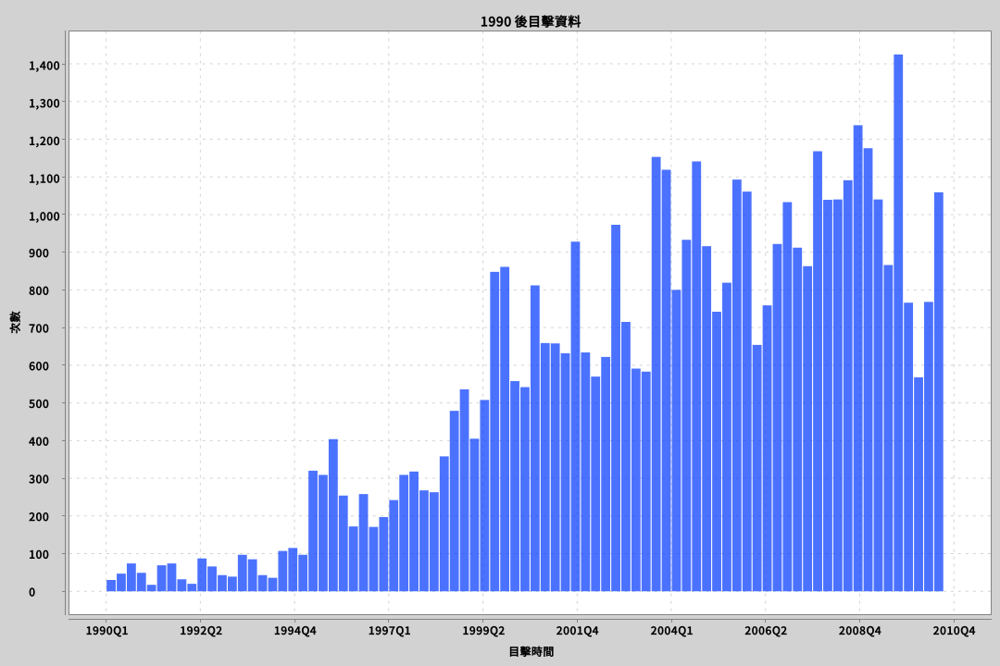
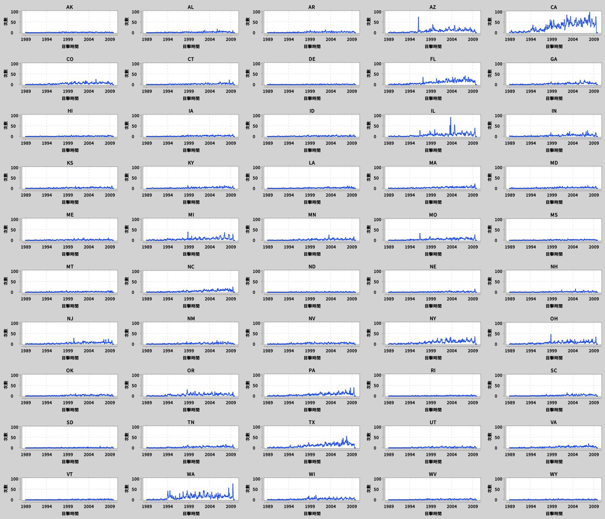

第一章、資料清理
=================

這一章的主要重點，在於我們所獲取的資料，不一定是能直接使用的。大部份的時候，我們會需要針對資料進行清理，以確保資料的正確性以及其代表性足夠。

此外，由於資料的來源各不相同，其儲存的型式也可能不同，例如可能是含表頭的，以 TAB 鍵分隔的 TSV 檔，也有可能是不含表頭的 TSV 檔，又或者是 JSON / XML……等等的檔案格式，因此我們也需要有能力在程式碼中，針對不同的檔案格式，解析成我們可以操作的資料結構。

此外，這一章也說明了如何針對進行簡單的作圖，以人類的直覺找出資料是否有可能的隱藏的關聯性或規律。

在這個範例程式裡，我們使用了 UFO 的目擊資料來做為範例。此處的檔案範例為無表頭，以 TAB 鍵為分隔的 TSV 檔，每一行為一筆 UFO 目擊資料。

這個範例程式最終的目的，是我們希望透過簡易的作圖，來初步觀察美國各洲的 UFO 目擊頻率是否有所差異，以及各洲的 UFO 目擊記錄是否與季節有所關聯，是否有固定的模式。

首先我們針對資料進行簡易的清理，清理的條件為：

1. 濾除沒有目擊日期的資料，因為在我們的觀察中，日期是重要因素，因此我們要確保資料並需有目擊時間。
2. 濾除非美國境內的資料，因為我們的最終目的，是以美國各州為一個單位，因此我們不在意美國之外的目擊記錄。

接著，我們進行非常初步的資料探堪，確認資料的範圍。

此部份的程式碼如下：

```scala
    // 拿到資料後，第一步需要清理資料，以這個例子來看，由於部份資料沒有「發生日期」這個資訊。
    // 而我們最終要分析的東西是「美國各州的 UFO 目擊次數是否有季節性規律」，所以我們需要進行
    // 以下的資料清理：
    //   1. 清除沒有目擊日期的資料
    //   2. 清除美國以外的資料
    val usOnlyUFOSightWithDate = allUFOSight
      .filterNot(sight => sight.dateOccurred.isEmpty || sight.dateReported.isEmpty)
      .filterNot(_.location.isEmpty)
      .filter(x => usStates.contains(x.location.get.state))

    // 先進行初步的資料探堪，可以發現最早於西元 1400 年就有 UFO 目擊報告。
    println("最舊一次的目擊日期：" + usOnlyUFOSightWithDate.map(_.dateOccurred.get).min)
    println("最新一次的目擊日期：" + usOnlyUFOSightWithDate.map(_.dateOccurred.get).max)
```

接著我們以十年為一個單位，進行直方圖作圖。

```scala
    // 首先我們針對所有美國的目擊資料進行直方圖作圖，從圖中可以看出資料集中在 1990 年後，
    //
    // 此圖片存放在 images/allSightsInUS.png 此檔案中。
    val allSights = new HistogramPlotter(usOnlyUFOSightWithDate).tenYearBuckets("所有目擊資料")
    BitmapEncoder.saveBitmap(allSights, "images/allSightsInUS.png", BitmapFormat.PNG)
```



從上圖中我們可以看出，資料集中在 1990 年之後。因此接下來，我們針對 1990 年後美國所有州的目擊資料，以季為單位進行直方圖作圖。

```scala
    // 接著我們針對 1990 年後的目擊資料，以季為單位進行直方圖作圖。
    // 從圖中我們可以看出，目擊次數似乎有隨著時間升高的趨勢。
    //
    // 此圖片存放在 images/modernSightsInUS.png 檔案中
    val usModernUFOSight = usOnlyUFOSightWithDate.filter(_.dateOccurred.get.getYear >= 1990)
    val modernSights = new HistogramPlotter(usModernUFOSight).quarterBuckets("1990 後目擊資料")
    BitmapEncoder.saveBitmap(modernSights, "images/modernSightsInUS.png", BitmapFormat.PNG)
```



最後，我們針對美國各州 1990 後的目擊次數，進行折線圖作圖，並整理至同一張大圖中：

```scala
    // 最後，針對美國各州 1990 後的目擊事件，我們分開進行折線圖作圖，並將其放到同一張大圖中。
    //
    // 從圖中可以看出，加州 (CA) 與華聖頓州 (WA) 的目擊記錄明顯比其他州多，
    // 而某些州有明顯的高峰期。
    //
    // 此圖片存放在 images/sightGirdByStates.png 檔案中
    val startYear = usModernUFOSight.map(_.dateOccurred.get.getYear).min
    val endYear = usModernUFOSight.map(_.dateOccurred.get.getYear).max
    val plotter = new LineChartPlotter(usModernUFOSight, startYear, endYear)
    val sightGridByStates = usStates.toList.sorted.map(plotter.plot)

    BitmapEncoder.saveBitmap(sightGridByStates.asJava, 10, 5, "images/sightGirdByStates.png", BitmapFormat.PNG)
```




我們可以看到，有某些洲，例如加州與華聖頓州，目擊頻率似乎比其他州高很多。順帶一提，著名的 51 區位於內華達州（NA），但從圖表上來看，這州的目擊記錄似乎反而沒有比其他熱點州，例如德州（TX）來得高呢。可能外星人在那邊墜機後被拿去解剖了，所以不敢再過來了。（誤
