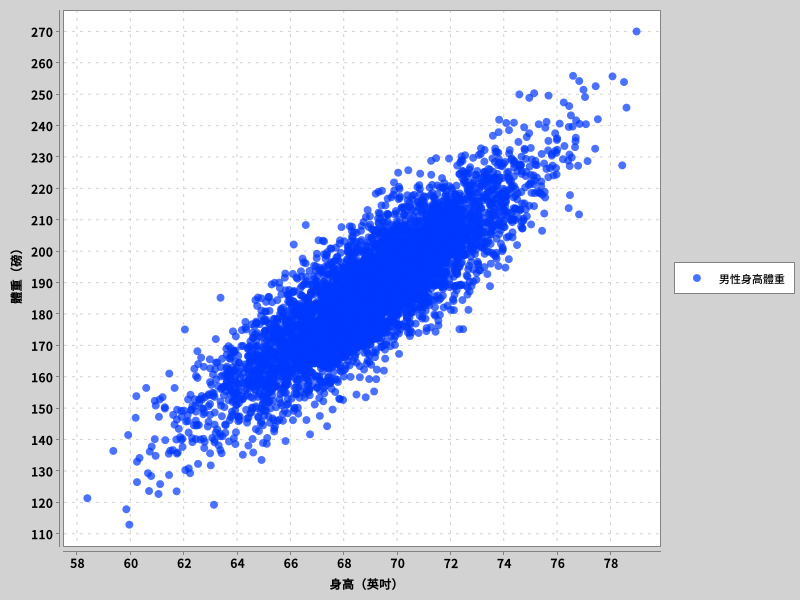

第二章、資料觀察
=================

在「[機器學習駭客秘笈][0]」第二章中，介紹了統計學基礎的相關概念，主要有以下幾個重點的概念：

1. 平均數
2. 中位數與百分位數
3. 眾數
4. 常態分佈、長尾與短尾分佈

因為上述的概念相當基本，也有許多統計學教材可以參照，程式碼實作也相對應單純，因此不納入這一章的範例程式裡。

這張的主要重點，在於如何透過簡單的製圖，用肉眼看出是否有什麼觀聯性。

在這個範例裡，我們採用了一萬人的性別、身高、體重的資料，做為我們的製圖用資料集。其中男性 5000 人，女性 5000 人。檔案格式為具有標頭的，以逗號為分隔的 CSV 檔案。其中第一欄為性別，第二欄為身高（吋），第三個欄位為體重（磅）。

針對這個資料集，我們會例用簡易的作圖，來觀察下面兩件事情：

1. 身高或體重，在這一萬人之中，其分佈是否有規律性
2. 身高與體重，這兩個參數，是否具有相關性

以作圖觀察分佈
------------------

分佈的製圖程式碼位於 [src/main/scala/regression/DistributionPlot.scala](src/main/scala/regression/DistributionPlot.scala) 檔案中。

我們首先讀取出一萬人的性別、身高、體重等資料，並讀取成我們可以處理的資料結構。

```scala
    val rows: List[Record] = Record.readFromCSVFile("data/01_heights_weights_genders.csv")
```

接著我們以一英吋為單位，進行身高的直方圖作圖。

```scala
    // 以一英吋為單位，製作身高直方圖。
    // 我們可以從圖中可以看出來，似乎有接近常態分佈。
    // 圖片存在 images/histogramChart1Inch.png 這個檔案中
    val histogram1Inch = HistogramLayer(rows.map(_.height), 1)
    val histogramChart1Inch = plot(List(histogram1Inch))
    BitmapEncoder.saveBitmap(histogramChart1Inch, "images/histogramChart1Inch.png", BitmapFormat.PNG)
```


這邊要注意的，是如果在直方圖製圖時，選擇的刻度太大，則圖型可能會失真，讓我們看不出其中的分佈。

```scala
    // 若刻度太粗糙，則可能會失真，觀察資料時應注意是否在合適的刻度上。
    // 下述以 5 英吋為單位，製作身高直方圖。
    // 這張圖已經看不太出來常態分佈的感覺了
    val histogram5Inch = HistogramLayer(rows.map(_.height), 5)
    val histogramChart5Inch = plot(List(histogram5Inch))
    BitmapEncoder.saveBitmap(histogramChart5Inch, "images/histogramChart5Inch.png", BitmapFormat.PNG)
```


但如果刻度過細，一樣會有問題，圖型會變得難以解讀。因此在觀察資料時，選擇合適的刻度是很重要的。

```scala
    // 若刻度過細，則可能會難以解讀資料，觀察資料時應注意是否在合適的刻度上。
    // 下述以 0.001 英吋為單位，製作身高直方圖。
    // 這張圖已經看不太出來常態分佈的感覺了
    val histogram001Inch = HistogramLayer(rows.map(_.height), 0.001)
    val histogramChart001Inch = plot(List(histogram001Inch))
    BitmapEncoder.saveBitmap(histogram001Inch, "images/histogramChart001Inch.png", BitmapFormat.PNG)
```


直方圖並不一定能夠很好的觀察到分佈的圖形，因此用密度圖可能是比較好的選擇。

這邊我們使用了兩種製圖函式庫，分別是 XChart 與 NSPL。XChart 並不支援密度圖，我們直接用直方圖的座標數據，將頂點連接起來。

```scala
    // 製作以 1 英吋為單位的身高密度圖，可以觀察到接近常態分佈，但頂部似乎有些平，
    // 這可能代表資料有隱藏的結構。
    //
    // 註：由於 XChart 繪圖函式庫的關係，此處並非真的密度圖，僅示意。
    val densityChart1Inch = plot(List(histogram1Inch), CategorySeriesRenderStyle.Area)
    val allDensityInXChart = new XYChartBuilder().xAxisTitle("身高").build()
    allDensityInXChart.addSeries("HelloWorld", histogram1Inch.histogram.getxAxisData(), histogram1Inch.histogram.getyAxisData())
    BitmapEncoder.saveBitmap(allDensityInXChart, "images/allDensityInXChart.png", BitmapFormat.PNG)
```


雖然可以看出大致上像是常態分佈，但可以看到線條並不圓滑，這是因為在繪製密度圖時，實際上應該要以特定的方式估算各個資料點的密度，所以用直方圖的座標數據，並不一定真的能看出分佈。

接著我們使用 NSPL 進行繪圖，此函式庫支援密度圖的繪製：

```scala
    // 使用 NSPL 繪制真正的 10000 人體身高密度圖
    // 檔案儲存在 images/allHeightDensityInNSPL.png 當中
    val allDensityInNPSL = xyplot
      { density(rows.map(_.height).toIndexedSeq, 1) -> line() }
      { par.withXLab("身高").withYLab("密度").withMain("10000 人身高密度圖") }

    pngToFile(new File("images/allHeightDensityInNSPL.png"), allDensityInNPSL)
```

可以看見若以全體的身高數據進行繪圖，相當接近於常態分佈，但在山頂的部份，卻出現了類似高原的型狀，這代表我們的資料可能有隱藏的結構。


接著我們可以猜測，會不會是男性女性的身高實際上有所不同？因此，我們可以針對男女性的身高分佈，分別作圖：

```scala
    // 因為我們懷疑資料有隱藏的結構，在這種情況下，我們可以試著將資料分組。
    // 以這個資料集而言，最簡單的分組方式就是以性別分組，所以我們可以試著針對不同性別分別作圖。
    // 從這張圖來看，確實有兩個集群。
    val maleHeight = rows.filter(_.gender == Male).map(_.height)
    val femaleHeight = rows.filter(_.gender == Female).map(_.height)
    val maleHeightHistogram = HistogramLayer(maleHeight, 1, "男性身高")
    val femaleHeightHistogram = HistogramLayer(femaleHeight, 1, "女性身高")
    val heightByGender = plot(List(maleHeightHistogram, femaleHeightHistogram), CategorySeriesRenderStyle.Area)
    BitmapEncoder.saveBitmap(histogramChart5Inch, "images/heightByGender.png", BitmapFormat.PNG)

    // 使用 NSPL 繪制男女分組的身高密度圖
    // 檔案儲存在 images/genderHeightDensityInNSPL.png 當中
    val heightDensityInNPSL = xyplot(
      density(maleHeight.toIndexedSeq, 1) -> line(color = Color.BLUE),
      density(femaleHeight.toIndexedSeq, 1) -> line(color = Color.RED),
    ) {
      par.withXLab("身高").withYLab("密度").withMain("10000 人身高密度圖")
    }
    pngToFile(new File("images/genderHeightDensityInNSPL.png"), heightDensityInNPSL)
```

從圖中我們可以看出，分開作圖後，男女性的身高均呈現常態分佈的鐘型特徵，且相較於上張圖形，此圖中的兩座山，其山頂均變得更尖了，更接近一般的常態分佈常見的狀況。


接著針對體重，一樣依照男女分組，進行分佈圖的繪製。從圖中可以看出，體重的部份也是接近常態分佈。

```scala
    // 針對體重，同樣依性別分開作圖，觀察是否有類似的現象。
    val maleWeight = rows.filter(_.gender == Male).map(_.weight)
    val femaleWeight = rows.filter(_.gender == Female).map(_.weight)
    val maleWeightHistogram = HistogramLayer(maleWeight, 5, "男性體重")
    val femaleWeightHistogram = HistogramLayer(femaleWeight, 5, "女性體重")
    val weightByGender = plot(List(maleWeightHistogram, femaleWeightHistogram), CategorySeriesRenderStyle.Area)
    BitmapEncoder.saveBitmap(weightByGender, "images/weightByGender.png", BitmapFormat.PNG)

    // 使用 NSPL 繪制男女分組的身高密度圖
    // 檔案儲存在 images/genderWeightDensityInNSPL.png 當中
    val weightDensityInNPSL = xyplot(
      density(maleWeight.toIndexedSeq, 5) -> line(color = Color.BLUE),
      density(femaleWeight.toIndexedSeq, 5) -> line(color = Color.RED),
    ) {
      par.withXLab("體重").withYLab("密度").withMain("10000 人身體重度圖")
    }
    pngToFile(new File("images/genderWeightDensityInNSPL.png"), weightDensityInNPSL)
```


以作圖觀察身高體重相關性
----------------------------

接著我們使用散佈圖作圖，來觀察身高與體重這兩個參數是否有關聯。製圖程式碼位於 [src/main/scala/regression/CorrelationPlot.scala](src/main/scala/regression/CorrelationPlot.scala) 檔案中。


首先，我們針對全體的身高體重進行散佈圖的製圖，橫軸為身高，縱軸為體重。

```scala
    val allData: List[Record] = Record.readFromCSVFile("data/01_heights_weights_genders.csv")

    // 針對全體身高體重進行繪圖，可以看出似乎身高與體重有相關性。
    // 也就是說，我們之後應該可以用線性迴歸的方式，以身高預測體重。
    // 圖片儲存於 images/allGenderScatter.png 中
    val allHeights = allData.map(_.height)
    val allWeights = allData.map(_.weight)
    val allGenderScatter = createScatterChart(ScatterLayer(allHeights, allWeights, "全體身高體重"))
    BitmapEncoder.saveBitmap(allGenderScatter, "images/allGenderScatter.png", BitmapFormat.PNG)
```

從圖中我們可以看出來，兩者似乎呈現正相關，也許我們之後可以用性線迴歸的方式，以身高預測體重。


接著我們針對男性的資料進行製圖，可以看出似乎也呈現正相關。

```scala
    // 針對男性身高體重進行繪圖，可以看出似乎身高與體重有相關性。
    // 也就是說，我們之後應該可以用線性迴歸的方式，以身高預測體重。
    // 圖片儲存於 images/maleScatter.png 中
    val maleHeights = allData.filter(_.gender == Male).map(_.height)
    val maleWeights = allData.filter(_.gender == Male).map(_.weight)
    val maleScatter = createScatterChart(ScatterLayer(maleHeights, maleWeights, "男性身高體重"))
    BitmapEncoder.saveBitmap(allGenderScatter, "images/maleScatter.png", BitmapFormat.PNG)
```



接著我們針對女性的資料進行製圖，可以看出似乎也呈現正相關。

```scala
    // 針對女性身高體重進行繪圖，可以看出似乎身高與體重有相關性。
    // 也就是說，我們之後應該可以用線性迴歸的方式，以身高預測體重。
    // 圖片儲存於 images/femaleScatter.png 中
    val femaleHeights = allData.filter(_.gender == Female).map(_.height)
    val femaleWeights = allData.filter(_.gender == Female).map(_.weight)
    val femaleScatter = createScatterChart(ScatterLayer(femaleHeights, femaleWeights, "女性身高體重", Some(Color.RED)))
    BitmapEncoder.saveBitmap(allGenderScatter, "images/femaleScatter.png", BitmapFormat.PNG)
```


最後，我們針對散佈圖上，男性與女性的資料，以不同的顏色呈現，可以看到圖型上似乎有明確的邊界。也就是說，我們之後也許有機會用機器學習建立分類演算法，給定一個身高體重，來判定這個人是男性還是女性。

```scala
    // 針對男性女性分組的身高體重進行繪圖，可以看出似乎身高與體重有相關性，
    // 且男女性似組別似乎在圖上是有明顯的分區的。
    //
    // 也就是說，我們之後有機會用機器學習建立分類演算法，給定一個身高體重，
    // 來判定這個人是男性還是女性。
    //
    // 圖片儲存於 images/groupScatter.png 中
    val groupScatter = createScatterChart(
      ScatterLayer(maleHeights, maleWeights, "男性身高體重"),
      ScatterLayer(femaleHeights, femaleWeights, "女性身高體重")
    )
    BitmapEncoder.saveBitmap(allGenderScatter, "images/groupScatter.png", BitmapFormat.PNG)
```


[0]: https://learning.oreilly.com/library/view/machine-learning-for/9781449330514/
